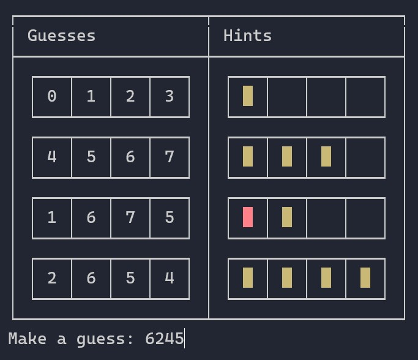

# Mastermind

A simple console game written in F#, and inspired by [Mastermind](https://en.wikipedia.org/wiki/Mastermind_(board_game)).

## Try it out

```dotnetcli
dotnet run --project Mastermind
```

Crack the code.

* Red key peg indicates that a number is correct, and in correct position.
* Yellow key peg indicates that a number is correct, but in wrong position.


